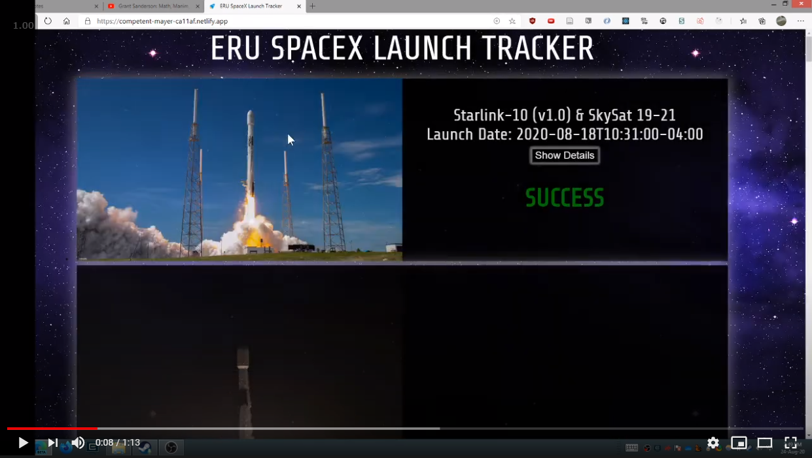

# ERU SpaceX App to consume GraphQL API

# Demo

- ReasonML
- [reason-apollo-client](https://github.com/reasonml-community/reason-apollo-client/tree/next)
- [@reasonml-community/graphql-ppx/ppx](https://beta.graphql-ppx.com/)
- GraphQL + Apollo
- Infinite Scroll
- an attempt at using [intersectionObserver API](https://developer.mozilla.org/en-US/docs/Web/API/Intersection_Observer_API) in `App.re`

## Building

`pnpm i` or `yarn install` or `npm install`

## Compile Reason to JS

`npm run watch`

## Start App

`npm start`
